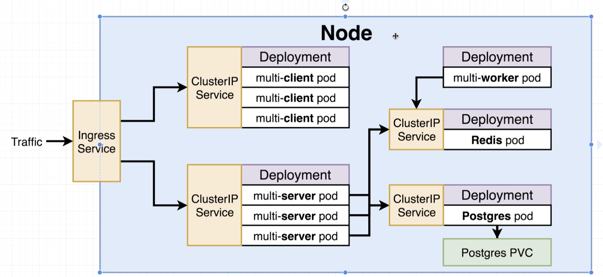
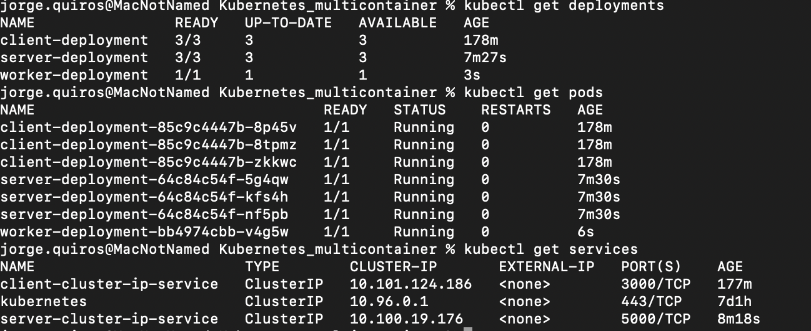
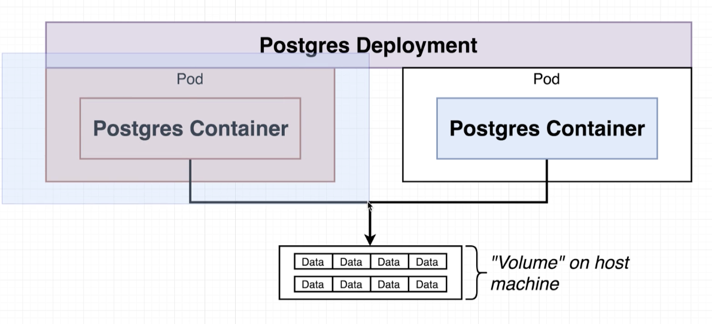
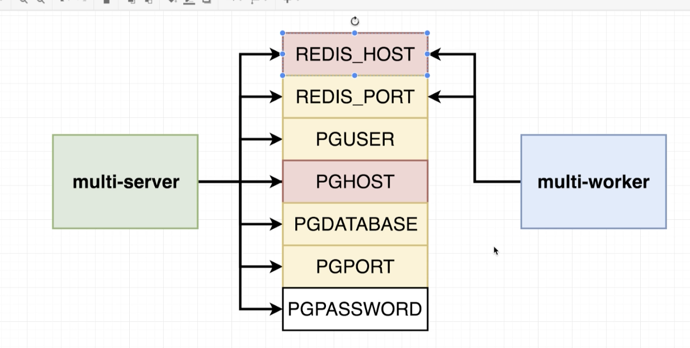
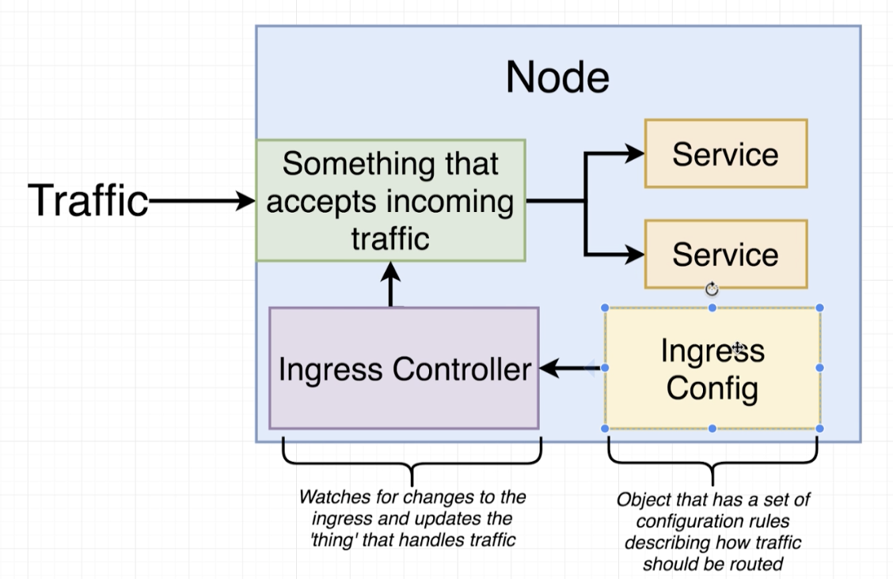
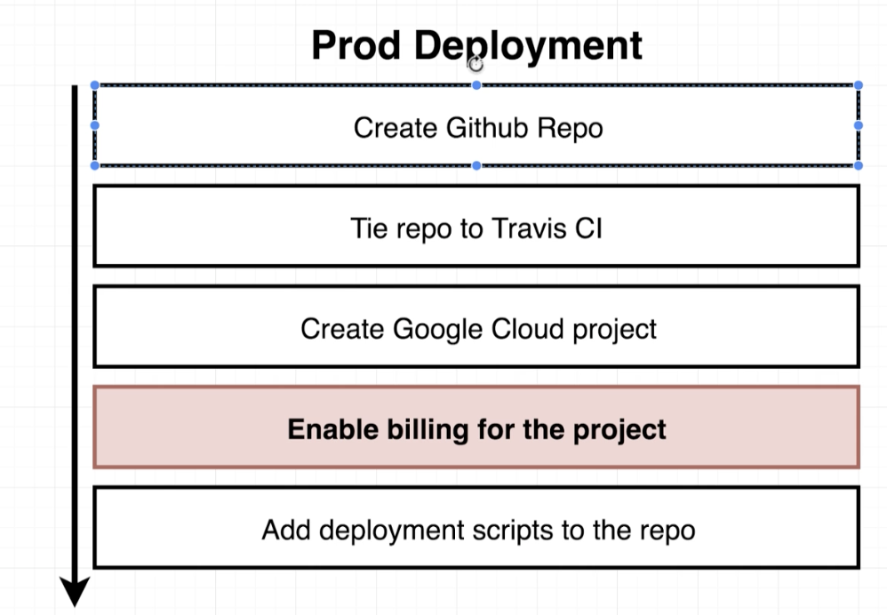
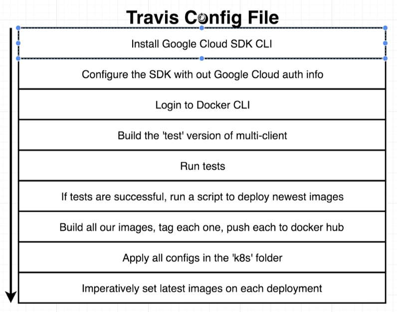
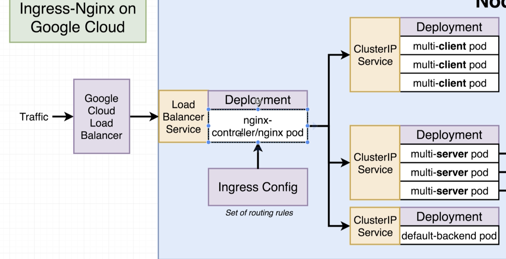
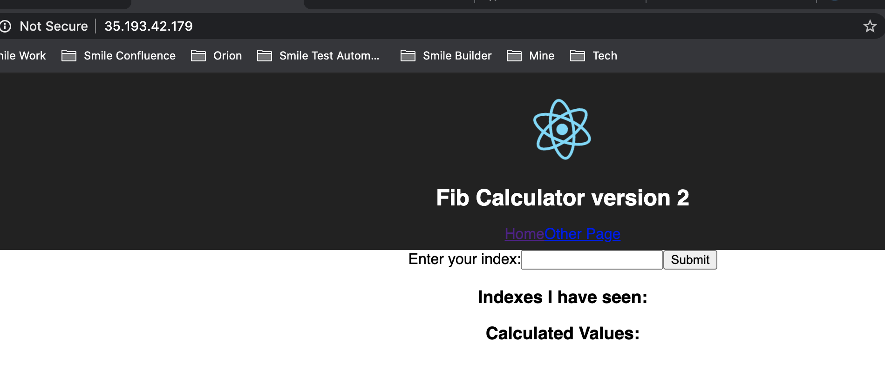
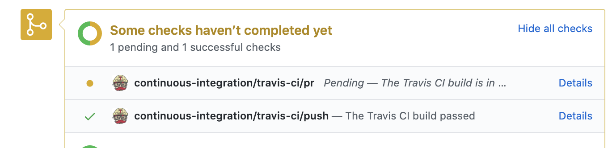

KUBERNETES USING MULTI CONTAINER PROJECT
========================================

1 Background
-------------

We are going to use the multi container project created in here https://github.com/testingtrail/Docker_multicontainers and we are going to use Kubernetes to scale that app, once we have it in our development environment then we will move it to a cloud service such as AWS or Google cloud every time there is a change in the CI/CD workflow using Github/Travis

So we are going to clone the files in that repo and we are going to use them in another new repo that is going to be kubernetes focused rather than just containers.

2 Setting up the config files
----------------------------

1. clone the repo https://github.com/testingtrail/Docker_multicontainers

2. run 'docker-compose up --build' to rebuild the images. (just to make sure everything works, stop the containers and run 'docker-compose biuld' again) **we are going to run it ust to make sure it is running**

3. go to localhost:3050 and test the app 

4. Delete following files as we are going to depend upon Kubertenes for deployment
    - docker-compose.yaml
    = Dockerrun.aws.json
    - .travis.yml (we are going to creater a new one later)
    - nginx server (we are going to rely on other thin)

5. Create folder K8s which will have all we need regarding configuration files starting with **client files (react app)**
    - create 'client-deployment.yaml' (for the client image)
    - create 'client-cluster-ip-service.yaml' (cluster ip service for muilti-client pods)

6. Load up both config file just to make sure we are ok so far. **There is a shorcut to apply a group of config files:**
    - 'kubectl apply -f k8s' by just putting the folder
    - Run 'kubectl get deployments' you will see 3 as we are creating 3 replicas in the file

7. **Adding config files for server (the Express API)**
    - Add file 'server-deployment.yaml' for the multi-server image
    - create 'server-cluster-ip-service.yaml' (cluster ip service for muilti-server pods)

8. **Adding config files for worker (the one that calculates the fibonacci)**
    - Add file 'worker-deployment.yaml' for the multi-worker image
    - There is nothing in the worker that needs to be accesible for anything else in the cluster so there is no cluster ip service.
    - Run ' kubectl apply -f k8s' to apply all the config files to add the new ones. By now you will have something like this
    
    

9. **Adding redis config files**
    - Add file 'redis-deployment.yaml' for the redis container
    - create 'redis-cluster-ip-service.yaml' (cluster ip service for redis pod)
    - Run ' kubectl apply -f k8s' to apply all the config files to add the new ones.

10. **Adding postgres config files**
    - Add file 'postgres-deployment.yaml' for the redis container
    - create 'postgres-cluster-ip-service.yaml' (cluster ip service for redis pod)
    - Run ' kubectl apply -f k8s' to apply all the config files to add the new ones.

3 Volumes and Databases
------------------------

We are going to see what Postgres PVC (persistent volume claim) is and why we need it. Postres container contains a file system where it writes data each time it receives a request to do it. But, if the POD crashes of course kubernetes is going to create a new pod with postgres but the data **is NOT going to be carried over** so we need a volume to store the data on host machine. **But in this case it will work fine with just 1 replica, as 2 or more replicas writing to the same volume is a recipe for disaster.**

So we have to put a config file for this (a PVC adversites the possible options you may have for volumes)

1. Creater file 'database-persistent-volume-claim.yaml'

2. If you hit 'kubectl get storageclass' in terminal, it will let you know all the options kubernetes has to storage data in a persistent volume. For cloud there are many options for storage classes [here](https://kubernetes.io/docs/concepts/storage/storage-classes/)

3. Link the PVC with the template in the POD for postgres by updating 'postgres-deployment.yaml' in the template section. The volume section in spec allocates the space and the config inside the container section use it. 

4. Apply it: Run 'kubectl apply -f k8s'

3 Defining environment variables
--------------------------------

Remember we need to set environment variables for two of the containers. 

1. We are going to set up all the environment variables (except PGPASSWORD)
    - Update 'worker-deployment.yaml' (env section)
    - Update 'server-deployment.yaml' (env section)

2. For the **PGPASSWORD** we are going to use a secret object. To create you do not use a config file but running an **imperative command** (to avoid typing a password in a config file)
    - Run 'kubectl create secret generic pgpassword --from-literal PGPASSWORD=12345pg'
    - Run 'kubectl get secrets' to see if that was created

3. Add the secret to our 'server-deployment.yaml' (using valueFrom to get it from the secrets object called pgpassword)

4. We need to update also 'postgres-deployment.yaml' so postgres know what is the password of the database, that is store in the secret object. As default the postgres container will use that variable called POSTGRES_PASSWORD to overwrite the password
    - Apply changes 'kubectl apply -f k8s'

4 using an ingress server
-------------------------

**we are going to be using ingress-ngix, a community led project** There is a separate project called kubernetes-ingress that is lead by Nginx company, **we are not going to use that one!** using a config file it will create an ingress controller to control the traffic to the outside world to your services for server and client (to your cluster-ip-services)

1. Go to https://github.com/kubernetes/ingress-nginx and go to documentation https://kubernetes.github.io/ingress-nginx/

2. Look for the mandatory command for kubectl or minikube (depending on which you are working on) and run that mandatory command.

3.  Verify the service was enabled by running the following: 'kubectl get svc -n ingress-nginx'

4. Creating the ingress configutation (routing rules)
    - Create 'ingress-service.yaml' ('kubernetes.io/ingress.class: inginx' this will tell our ingress service will be bases on nginx kubernetes project and 'nginx.ingress.kubernetes.io/rewrite-target: /$1' tells that if it finds /api just convert it to /)
    - Apply it: 'kubectl apply -f k8s'

5. Testing it (if using minikube rune 'minikube ip' to get the ip). Go to https://localhost:80 (ingress creates in port 80 or 443 by default), **it has to be https**
    - APP should be working as expected!!!

5 Setting up Docker'desktop kubernetes dashboard
-----------------------------------------------

**Applies only for docker's desktop kubernetes version**

1. Go to https://github.com/kubernetes/dashboard

2. run the following in your directory curl -O https://raw.githubusercontent.com/kubernetes/dashboard/v1.10.1/src/deploy/recommended/kubernetes-dashboard.yaml

3. Open up the downloaded file in your code editor and find line 116. Add the following two lines underneath --auto-generate-certificates
    - --enable-skip-login
    - --disable-settings-authorizer

4. Run the following command inside the directory where you downloaded the dashboard yaml file 'kubectl apply -f kubernetes-dashboard.yaml'

5. Start the server by running the following command: 'kubectl proxy'

6. Access the dashboard: http://localhost:8001/api/v1/namespaces/kube-system/services/https:kubernetes-dashboard:/proxy/
    - You will be presented with a login screen
    - Click the "SKIP" link next to the SIGN IN button.
    - **if you are not entering click quickly on the + symbol and then you will be inside**

7. **CLEANING UP RESOURCES**
    - IF USING MINIKUBE: enter minikube stop (if you want to start again minikube start)
    - if using kubernetes for docker desktop: go to docker --> settings -> kubernetes -> reset kubernetes cluster or if you want to disable it uncheck enable kubernetes

6 Deploying to Production!! First Steps!!
-----------------------------------------------

So for production we are going to use Google cloud this time. Reasons to use Google cloud instead of AWS are: google created kubernetes (understand it at very low level), it is easier to poke around Kubernetes on Google cloud, excellent documentation.

**DISCLOSURE: if you run this you will end up paying like 1.50$ per day so have that in mind, you can first go to the section and then make everything quick to avoid more charges**

 These are the steps we are going to follow.

1. Create github repository

2. Link github to a travis repository (https://travis-ci.org/)
    - Go to your travis account and in settings go to repository and select the repository created in previous step. (if you don't have travis account create one using your github login)

3. create google cloud account (https://console.cloud.google.com/)
    - You can create a free account but you have to add a payment method.
    -  Go to the top menu and create new project, put something like 'multi-k8s'
    - Go to menu -> compute -> kubernetes engine (it shows a message telling you 'Kubernetes Engine API is being enabled....')
    - Once that is done click on 'create cluster' -> name(multi-cluster)
        - node pools (choose 3 nodes) -> for machine you can leave 3.75 GB CPU
        - Click on create
    - **Remember if you need to clean up to avoid billing go to https://www.udemy.com/course/docker-and-kubernetes-the-complete-guide/learn/lecture/11684242?start=0#overview and see the steps**

7 More on Travis configuration file
-----------------------------------------------

Travis will help not just to test but also deploy our application to google cloud, that means we will have many configuration in our travis.yml file, we are going to configure the following:

1. We have to first install the Google Cloud SDK for Travis
    - The 'bash > /dev/null;' command will install the first part (sdk url) in our little instance of TravisCi
    - This command 'source $HOME/google-cloud-sdk/path.bash.inc' will take the .inc file and apply additional configurations, so the source command loads any functions file into the current shell script or a command prompt

2. Generating a service account
    - go to google cloud -> IAM & Admin -> Service Accounts -> Create service account -> put a name like 'travis-deployer' -> click create -> select 'kubernetes engine admin' as roled -> done
    - Then once created in the service accounts dashboard check the service account created -> actions (on the right) -> create key -> JSON. **It will download a file which is the one we are going to upload to Travis CI CLI, DO NOT EXPOSE THAT FILE TO THE OUTSIDE WORLD**

3. **Install Travis CI CLI**
    - we are going to run it in a container to avoid install on our machines, because we need Ruby to be installed
    - Run 'docker run -it -v $(pwd):/app ruby:2.4 sh' this will install the ruby 2.4 image, also will open a shell and also create a volume in the current directory (${pwd}) to map it to the /app folder in the container
    - Run ls (we are inside the container), you will see the app folder, then go to that folder and run 'ls', you will see all the folders of this project (because we map it with the volume)
    - Install Travis in that container: 'gem install travis --no-document'
    - Run 'travis' enter N for shell auto completion as we don't need it for anything
    - RUN 'travis login --org' to connect to our personal account (remember this is github credentials)
    
4. Copy JSON file in our volumed folder so we can use it in the container (rename it to like 'service-account.json')
    - go to the app folder so we can see te 'service-account.json' and run 'travis encrypt-file service-account.json -r testingtrail/kubernetes_multicontainer --org'. **Add the command that it will tells you to add in the travis.yml. 
    - **DELETE THE ORIGINAL SERVICE-ACCOUNT.JSON**
    - Exit from the container
    - Commit changes

5. Add the project we want to use in the google cloud
    - 'gcloud config set project <projectID>' the name of the project is the ID of the project
    - put your kubernetes location
    - add the cluster

6. Create docker password and docker username in Travis
    - go to project in travis -> more options -> settings -> environment variables
    - create DOCKER_USERNAME and DOCKER_PASSWORD and put the values your docker cli
    - add the Dockerfile.dev we need to run to test the app
    - The test is not needed,we added it for reference if you need to know how to set it for future projects

7. Adding files for deployment
    - Travis does not have commands directly to deploy to Kubernetes so we have to pass it the commands
    - we are going to crete a sh file to build the images and then upload them to docker hub
    - we can use docker and kubectl in the sh because they were both configured in the travis.yml already
    - **we need to put tags so kubectl sees them and update the image, if not it will continue using the one it was using (latest is default tag, that is why)** so to make it automatically and have a different image each time we are going to use the GIT SHA (each commit has an unique SHA). We are going to store it here: 'SHA=$(git rev-parse HEAD)'

8 More on Google Cloud configuration
-------------------------------------

1. First connect to your kubernetes cluster using google cloud terminal (you have to do this just once)
    - go to the top of kubernetes dashboard and look for 'activate cloud shell'
    - Run there this 'gcloud config set project <projectID>'
    - Run 'gcloud config set compute/zone <the zone of your kubernetes project>'
    - Run 'gcloud container clusters get-credentials cluster-1'

2. We need to configure the value for the PG password to pass it to server-deployment object
    - create the secret for PGpassword running this on that google cloud terminal 'kubectl create secret generic pgpassword --from-literal PGPASSWORD=<Whateverpassword>' 123passOK

3. we have to create our ingress-nginx for google cloud, we have to install it as a separate service. We will have the ingress config and also will create the load balancer.
    - we are going to use HELM
    - Here's the diagram on how that ingress-nginx works

    

9 Configuring HELM for our ingress service
------------------------------------------

HELM is a program that allows us to administer third party programs inside our kubernetes cluster. It is a package manager for Kubernetes (https://helm.sh/). Helm is a client and it relates it to Tiller (it is a POD created that make changes to the cluster) So Helm is more like a CLI and tiller the one who acts. There is something called RBAC (role based access control) on google cloud that limits who can access and modify objects in the cluster, so Tiller needs to get permissions for it. (creating a service account)

1. Run the following commands in google cloud terminal
    - 'curl https://raw.githubusercontent.com/helm/helm/master/scripts/get-helm-3 > get_helm.sh'
    - 'chmod 700 get_helm.sh'
    - './get_helm.sh'
    - Run 'helm repo add stable https://kubernetes-charts.storage.googleapis.com/'
    - Run 'helm install my-nginx stable/nginx-ingress --set rbac.create=true ' to install the nginx-ingress

2. If you refresh the page and go to 'workloads' you will see the ingress controller (**the deployment that manages the POD that runs the actual controller that reads ingress config file and setup nginx**) and the default backend (have checks to healthy run). If you go to 'services and ingress' you will see the ip for the ingress controller, the default 404 page is created for the default backend. 

10 FINALLY, DEPLOY ON PRODUCTION
--------------------------------

1. Commit and push to Github

2. Go to travis and check the build running and you will see all the steps. At the end if there are no issues the built will success

3. If you go to the cluster to the 'workloads' in the left meny you will see all the deployment in OK status.

4. If you go to 'services & ingress' you will see all the cluster ip and the ingress service, all in OK status.

5. If you go to storage you will see a persistent volume, the one that is created in 'database-persistent-volume-claim.yaml'

6. NOW, go to your 'my-nginx-nginx-ingress-controller' and click on endpoints, it should load the app!!!

**Note: if you need to make a change in your app follow these steps**

    - Check out a branch: 'git checkout -b mynewbranch'
    - Make a change, for instance go to client->src->App.js and change the title to 'Fib Calculator!!!'
    - Run 'git status' to make sure you made the changes
    - Stage the changes: 'git add .'
    - Commit changes 'git commit -m "changing head title"'
    - Push: 'git push origin mynewbranch'
    - Create a pull request on Github
        - Go to 'pull request' tab -> new pull request -> select the new branch on the right dropdown so it looks something like: 'base:master <- compare:newbranch'
        - Click on 'create pull request'
        - Enter some comment -> 'create pull request'
        - **wait on travis to run the test**

    - Now both the push and the pr are done in travis you can just **merge** it. (you can choose if travis will run the test with each push or just with the PRs)
        - Click on 'merge pull request' -> 'confirm merge'
        - You can click on 'delete the branch' if you want
        - Travis will run after the merge and then it will be deployed automatically in cloud!!
    - Delete local branch

**NOTE: if you want to see how to set up https in your site continue to section 17 on the course for Docker and Kubernetes: The Complete Guide from Stephen Grider. You will have to buy a domain!**
